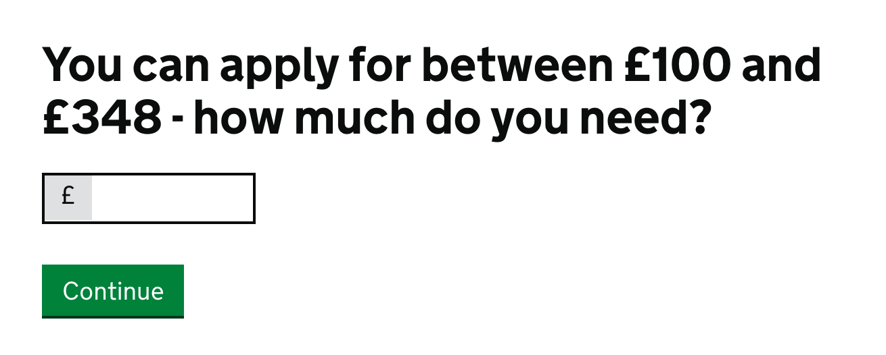

# The input denote component

The input denote component module simply adds a visual box treatment before or after an input.

This extends current GOV.UK styles.

## HTML Example

```

<h1 id="legend-heading" class="heading-large">Descriptive Heading</h1>

<div id="example-question" class="form-group inline">
    <span class="c-form-input-denote">£</span>
    <input class="form-control c-form-input-denote__input form-control-1-4" aria-labelledby="legend-heading" type="text" name="example">
</div>

```

## Visual Example

This is an example taken from [Apply for a Budgeting Loan](https://www.gov.uk/budgeting-help-benefits/how-to-claim).




## Usage

Once this has been installed you will need to include it in your Sass files.


links

- [Codepen Demo](http://codepen.io/jonhurrell/pen/wMQmVe?editors=1100)
